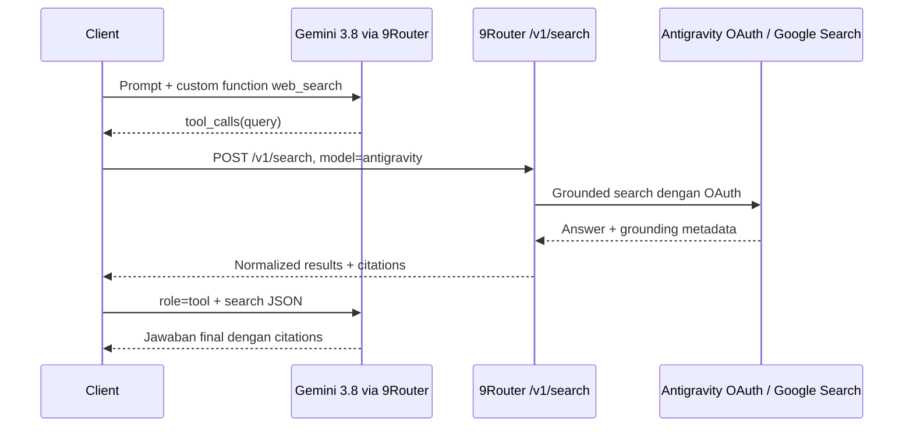

# 9Router + Antigravity OAuth: Web Search Tanpa Gemini API Key

Dokumen ini menjelaskan hasil pengujian web search pada 9Router menggunakan akun Google Antigravity yang terhubung lewat OAuth. Fokusnya adalah memakai model `ag/gemini-3.8-flash-high` untuk percakapan, sementara pencarian web dijalankan melalui endpoint khusus 9Router.

Dokumen ini dibuat berdasarkan pengujian langsung pada 4 September 2026.

## Ringkasan hasil

Web search **bisa digunakan tanpa Gemini API key**. API key yang dikirim client tetap API key milik 9Router, sedangkan autentikasi ke Google dilakukan oleh 9Router menggunakan access token OAuth Antigravity yang sudah tersimpan.

Namun, web search tidak berjalan otomatis hanya dengan mengirim format built-in seperti:

```json
{
  "tools": [{ "type": "web_search" }]
}
```

Pada jalur `/v1/chat/completions`, format tersebut menyebabkan model mencoba memanggil search, tetapi hasilnya berhenti dengan:

```json
{
  "finish_reason": "malformed_function_call",
  "message": {
    "content": ""
  }
}
```

Solusi yang terbukti berhasil adalah:

1. Daftarkan `web_search` sebagai **custom function tool** pada request chat ke Gemini 3.8.
2. Ambil `tool_calls` yang dibuat model.
3. Jalankan query tersebut melalui `POST /v1/search` dengan provider `antigravity`.
4. Kirim hasil pencarian kembali sebagai message dengan `role: "tool"`.
5. Panggil Gemini 3.8 sekali lagi untuk menghasilkan jawaban final beserta citations.



## Lingkungan pengujian

| Komponen | Nilai |
|---|---|
| Base URL | `https://9router.adoetz52.my.id/v1` |
| Versi 9Router | `0.5.65` |
| Model chat | `ag/gemini-3.8-flash-high` |
| Provider search | `antigravity` |
| Model search internal | `gemini-2.5-flash` |
| Autentikasi client | `Authorization: Bearer <9ROUTER_API_KEY>` |
| Autentikasi Google | OAuth Antigravity yang disimpan 9Router |

URL yang sebelumnya tertulis dua kali dianggap typo. Gunakan hanya:

```text
https://9router.adoetz52.my.id/v1
```

Jangan gunakan:

```text
https://9router.adoetz52.my.id/v1https://9router.adoetz52.my.id/v1
```

## Persiapan environment

Jangan menaruh API key secara hard-coded di source code atau dokumentasi. Gunakan environment variable.

### Bash

```bash
export NINEROUTER_BASE_URL="https://9router.adoetz52.my.id/v1"
export NINEROUTER_API_KEY="<9ROUTER_API_KEY>"
```

### PowerShell

```powershell
$env:NINEROUTER_BASE_URL = "https://9router.adoetz52.my.id/v1"
$env:NINEROUTER_API_KEY = "<9ROUTER_API_KEY>"
```

API key yang pernah dibagikan secara terbuka atau dimasukkan ke chat sebaiknya segera dihapus atau dirotasi setelah pengujian.

## Tes 1 — Cek versi 9Router

Request:

```bash
curl "https://9router.adoetz52.my.id/api/version" \
  -H "Authorization: Bearer $NINEROUTER_API_KEY"
```

Response yang didapat saat tes:

```json
{
  "currentVersion": "0.5.65",
  "latestVersion": "0.5.65",
  "hasUpdate": false
}
```

Kesimpulan: instance sudah memakai versi yang mempunyai endpoint `/v1/search` dan dukungan search melalui Antigravity OAuth.

## Tes 2 — Cek model yang tersedia

Request:

```bash
curl "$NINEROUTER_BASE_URL/models" \
  -H "Authorization: Bearer $NINEROUTER_API_KEY"
```

Model yang relevan pada response:

```json
{
  "id": "ag/gemini-3.8-flash-high",
  "owned_by": "ag",
  "capabilities": {
    "search": true,
    "tools": true,
    "reasoning": true
  }
}
```

Model chat yang valid antara lain:

```text
ag/gemini-3.8-flash
ag/gemini-3.8-flash-high
ag/gemini-3.8-flash-medium
ag/gemini-3.8-flash-low
```

Gunakan ID lengkap dengan prefix `ag/`. ID lengkap menghindari ambiguity pada routing provider.

### Ketidakkonsistenan discovery

Endpoint berikut juga dites:

```bash
curl "$NINEROUTER_BASE_URL/models/web" \
  -H "Authorization: Bearer $NINEROUTER_API_KEY"
```

Saat pengujian, endpoint tersebut hanya menampilkan:

```json
{
  "object": "list",
  "data": [
    {
      "id": "glm/search",
      "kind": "webSearch",
      "owned_by": "glm"
    }
  ]
}
```

Walaupun `antigravity` tidak tampil pada daftar tersebut, request langsung dengan `model: "antigravity"` ke `/v1/search` terbukti berhasil. Untuk sementara, jangan menjadikan `/v1/models/web` sebagai satu-satunya sumber capability discovery.

## Tes 3 — Pastikan chat biasa berfungsi

Request:

```bash
curl "$NINEROUTER_BASE_URL/chat/completions" \
  -H "Authorization: Bearer $NINEROUTER_API_KEY" \
  -H "Content-Type: application/json" \
  -d '{
    "model": "ag/gemini-3.8-flash-high",
    "messages": [
      {
        "role": "user",
        "content": "What is 2+2? Answer only the number."
      }
    ],
    "max_tokens": 50,
    "stream": false
  }'
```

Response:

```json
{
  "model": "gemini-3.8-flash",
  "choices": [
    {
      "message": {
        "role": "assistant",
        "content": "4"
      },
      "finish_reason": "stop"
    }
  ]
}
```

Kesimpulan: koneksi, API key 9Router, OAuth Antigravity, dan model chat berfungsi normal. Masalah hanya muncul ketika search/tool dipanggil dengan format yang tidak sesuai.

## Format yang gagal

### 1. OpenAI built-in `web_search`

Payload:

```json
{
  "model": "ag/gemini-3.8-flash-high",
  "messages": [
    {
      "role": "user",
      "content": "Search the live web for the current Reuters World top headline."
    }
  ],
  "tools": [
    {
      "type": "web_search"
    }
  ],
  "stream": false
}
```

Hasil:

```json
{
  "choices": [
    {
      "message": {
        "role": "assistant",
        "reasoning_content": "Model merencanakan pencarian...",
        "content": ""
      },
      "finish_reason": "malformed_function_call"
    }
  ]
}
```

### 2. `web_search_options`

Payload:

```json
{
  "model": "ag/gemini-3.8-flash-high",
  "messages": [
    {
      "role": "user",
      "content": "Search the live web for current news."
    }
  ],
  "web_search_options": {},
  "stream": false
}
```

Hasilnya sama: `malformed_function_call` dengan `content` kosong.

### 3. Native Gemini tool shape pada Chat Completions

Payload:

```json
{
  "model": "ag/gemini-3.8-flash-high",
  "messages": [
    {
      "role": "user",
      "content": "Search the live web for current news."
    }
  ],
  "tools": [
    {
      "google_search": {}
    }
  ],
  "stream": false
}
```

Hasilnya tetap `malformed_function_call`. Bentuk native Gemini tidak dapat langsung dimasukkan ke endpoint OpenAI Chat Completions.

### 4. Responses API dengan built-in `web_search`

Payload:

```json
{
  "model": "ag/gemini-3.8-flash-high",
  "input": "Search the web for current Reuters headlines.",
  "tools": [
    {
      "type": "web_search"
    }
  ]
}
```

Request ke `/v1/responses` menerima event selesai, tetapi tidak memberikan output pencarian:

```text
event: response.completed
data: {"type":"response.completed","response":{"status":"completed"}}
```

Kesimpulan: pada instance yang dites, Responses API belum menjadi workaround untuk built-in search Antigravity.

### 5. Native Gemini route

Payload native-style juga dites ke route seperti:

```text
POST /v1beta/models/ag%2Fgemini-3.8-flash-high:generateContent
```

Dengan body:

```json
{
  "contents": [
    {
      "role": "user",
      "parts": [
        {
          "text": "Search the live web for current Reuters headlines."
        }
      ]
    }
  ],
  "tools": [
    {
      "google_search": {}
    }
  ]
}
```

Route mengembalikan reasoning text, tetapi tidak menjalankan search dan tidak memberikan grounding metadata. Mengarahkan converter langsung ke API publik Gemini juga bukan solusi untuk skenario ini karena API publik tersebut meminta Gemini API key, bukan credential OAuth Antigravity milik 9Router.

## Kenapa format-format tersebut gagal?

Ada tiga lapisan berbeda yang sering tercampur:

1. **Tool declaration** — memberi tahu model bahwa function `web_search` tersedia.
2. **Tool-call conversion** — mengubah keluaran native Gemini menjadi `tool_calls` format OpenAI.
3. **Tool execution** — benar-benar melakukan pencarian dan mengembalikan hasil kepada model.

Pada payload built-in yang gagal, model mengetahui bahwa pencarian dibutuhkan dan bahkan menuliskan rencana pencarian pada `reasoning_content`. Namun, pemanggilan tool yang dihasilkan tidak berhasil diparse pada jalur translator tersebut, sehingga 9Router mengembalikan `malformed_function_call`.

Walaupun converter berhasil menghasilkan tool call, converter saja belum menjalankan search. Harus ada executor yang:

- menerima nama function dan argument dari model;
- memanggil `/v1/search`;
- mengirim response search kembali sebagai `role: "tool"`;
- meminta model menyusun jawaban final.

## Format yang berhasil — custom function tool

Gunakan function tool OpenAI standar berikut:

```json
{
  "type": "function",
  "function": {
    "name": "web_search",
    "description": "Search the live web for current information",
    "parameters": {
      "type": "object",
      "properties": {
        "query": {
          "type": "string",
          "description": "Search query"
        }
      },
      "required": ["query"],
      "additionalProperties": false
    }
  }
}
```

### Request pertama: minta Gemini membuat tool call

```bash
curl "$NINEROUTER_BASE_URL/chat/completions" \
  -H "Authorization: Bearer $NINEROUTER_API_KEY" \
  -H "Content-Type: application/json" \
  -d '{
    "model": "ag/gemini-3.8-flash-high",
    "messages": [
      {
        "role": "user",
        "content": "Find the current Reuters World top headline. Use web_search."
      }
    ],
    "tools": [
      {
        "type": "function",
        "function": {
          "name": "web_search",
          "description": "Search the live web for current information",
          "parameters": {
            "type": "object",
            "properties": {
              "query": {
                "type": "string"
              }
            },
            "required": ["query"],
            "additionalProperties": false
          }
        }
      }
    ],
    "tool_choice": "required",
    "max_tokens": 500,
    "stream": false
  }'
```

Response yang berhasil:

```json
{
  "choices": [
    {
      "message": {
        "role": "assistant",
        "tool_calls": [
          {
            "id": "call_web_search_1788527022497_0",
            "type": "function",
            "function": {
              "name": "web_search",
              "arguments": "{\"query\":\"Reuters World news top headline site:reuters.com/world\"}"
            }
          }
        ]
      },
      "finish_reason": "tool_calls"
    }
  ]
}
```

Indikator keberhasilan:

- `finish_reason` bernilai `tool_calls`;
- terdapat `message.tool_calls`;
- `function.name` bernilai `web_search`;
- `function.arguments` berisi JSON string dengan field `query`.

## Menjalankan pencarian melalui Antigravity OAuth

Ambil `query` dari `function.arguments`, kemudian kirim ke endpoint khusus search.

```bash
curl "$NINEROUTER_BASE_URL/search" \
  -H "Authorization: Bearer $NINEROUTER_API_KEY" \
  -H "Content-Type: application/json" \
  -d '{
    "model": "antigravity",
    "query": "Reuters world news headlines today",
    "max_results": 5
  }'
```

`provider` dapat dipakai sebagai alias field `model`:

```json
{
  "provider": "antigravity",
  "query": "Reuters world news headlines today",
  "max_results": 5
}
```

Contoh response yang telah disingkat:

```json
{
  "provider": "antigravity",
  "query": "Reuters world news headlines today",
  "results": [
    {
      "title": "Example source",
      "url": "https://vertexaisearch.cloud.google.com/grounding-api-redirect/...",
      "snippet": "Grounded excerpt from the source.",
      "position": 1,
      "citation": {
        "provider": "antigravity",
        "retrieved_at": "2026-09-04T13:04:27.357Z",
        "rank": 1
      }
    }
  ],
  "answer": {
    "source": "antigravity",
    "text": "Grounded answer generated by the search model.",
    "model": "gemini-2.5-flash"
  },
  "usage": {
    "queries_used": 1,
    "search_cost_usd": 0,
    "llm_tokens": 455
  },
  "errors": []
}
```

Ini membuktikan bahwa pencarian dilakukan melalui OAuth Antigravity yang tersimpan di 9Router. Client tidak mengirim Gemini API key.

### Kenapa model search-nya Gemini 2.5 Flash?

`model: "antigravity"` pada `/v1/search` memilih **search provider**, bukan model chat. Pada implementasi 9Router yang dites, provider Antigravity memakai `gemini-2.5-flash` sebagai model default untuk Google Search grounding.

Model `ag/gemini-3.8-flash-high` tetap digunakan sebelum search untuk menyusun query dan setelah search untuk menyusun jawaban final.

## Mengirim hasil search kembali ke Gemini 3.8

Pertahankan message user dan assistant yang berisi tool call, kemudian tambahkan message tool:

```json
{
  "model": "ag/gemini-3.8-flash-high",
  "messages": [
    {
      "role": "user",
      "content": "Find the current Reuters World top headline. Use web_search and cite the source."
    },
    {
      "role": "assistant",
      "content": null,
      "tool_calls": [
        {
          "id": "call_web_search_1788527022497_0",
          "type": "function",
          "function": {
            "name": "web_search",
            "arguments": "{\"query\":\"Reuters world news headlines today\"}"
          }
        }
      ]
    },
    {
      "role": "tool",
      "tool_call_id": "call_web_search_1788527022497_0",
      "content": "{\"provider\":\"antigravity\",\"query\":\"Reuters world news headlines today\",\"results\":[...],\"answer\":{...}}"
    }
  ],
  "max_tokens": 1000,
  "stream": false
}
```

Penting:

- `tool_call_id` harus sama dengan `id` dari tool call sebelumnya.
- `content` pada message tool berupa string. Serialize seluruh response `/v1/search` menggunakan `JSON.stringify`.
- Untuk pola dua tahap yang sederhana, tools dapat dihilangkan pada request final agar model langsung melakukan synthesis.
- Untuk agent loop multi-step, tools boleh tetap dikirim, tetapi batasi jumlah iterasi agar tidak terjadi loop tanpa akhir.

Hasil tes end-to-end:

```text
TOOL_QUERY=Reuters world news headlines today
SEARCH_RESULTS=5
FINAL_FINISH=stop
FINAL_CONTENT=<ringkasan berita dengan citation links>
```

## Implementasi bridge lengkap dengan Node.js

Contoh berikut menggunakan `fetch` bawaan Node.js 18 atau lebih baru. Tidak membutuhkan dependency tambahan.

Simpan sebagai `antigravity-search-bridge.mjs` jika ingin menjalankannya sebagai program terpisah.

```js
const BASE_URL = (
  process.env.NINEROUTER_BASE_URL ||
  "https://9router.adoetz52.my.id/v1"
).replace(/\/$/, "");

const API_KEY = process.env.NINEROUTER_API_KEY;

if (!API_KEY) {
  throw new Error("NINEROUTER_API_KEY belum diset");
}

const headers = {
  Authorization: `Bearer ${API_KEY}`,
  "Content-Type": "application/json",
};

const sleep = (ms) => new Promise((resolve) => setTimeout(resolve, ms));

async function postJson(path, body, maxAttempts = 4) {
  let lastError;

  for (let attempt = 1; attempt <= maxAttempts; attempt += 1) {
    const response = await fetch(`${BASE_URL}${path}`, {
      method: "POST",
      headers,
      body: JSON.stringify(body),
    });

    const responseText = await response.text();
    let data;

    try {
      data = JSON.parse(responseText);
    } catch {
      data = { raw: responseText };
    }

    if (response.ok) {
      return data;
    }

    lastError = new Error(
      `${path} gagal: HTTP ${response.status} ${responseText}`
    );

    const retryable = response.status === 429 || response.status === 503;
    if (!retryable || attempt === maxAttempts) {
      throw lastError;
    }

    const retryAfterSeconds = Number(response.headers.get("retry-after"));
    const delayMs = Number.isFinite(retryAfterSeconds)
      ? retryAfterSeconds * 1000
      : Math.min(1000 * 2 ** (attempt - 1), 8000);

    await sleep(delayMs);
  }

  throw lastError;
}

const webSearchTool = {
  type: "function",
  function: {
    name: "web_search",
    description: "Search the live web for current information",
    parameters: {
      type: "object",
      properties: {
        query: {
          type: "string",
          description: "Search query",
        },
      },
      required: ["query"],
      additionalProperties: false,
    },
  },
};

async function askWithWebSearch(userPrompt) {
  const userMessage = {
    role: "user",
    content: userPrompt,
  };

  // Tahap 1: Gemini 3.8 membuat query search.
  const firstResponse = await postJson("/chat/completions", {
    model: "ag/gemini-3.8-flash-high",
    messages: [userMessage],
    tools: [webSearchTool],
    tool_choice: "required",
    max_tokens: 500,
    stream: false,
  });

  const assistantMessage = firstResponse.choices?.[0]?.message;
  const toolCall = assistantMessage?.tool_calls?.[0];

  if (!toolCall || toolCall.function?.name !== "web_search") {
    throw new Error(
      `Model tidak menghasilkan web_search tool call: ${JSON.stringify(firstResponse)}`
    );
  }

  let toolArguments;
  try {
    toolArguments = JSON.parse(toolCall.function.arguments);
  } catch {
    throw new Error(
      `Argument tool bukan JSON valid: ${toolCall.function.arguments}`
    );
  }

  if (!toolArguments.query) {
    throw new Error("Tool call tidak mempunyai argument query");
  }

  // Tahap 2: jalankan Google Search grounding melalui OAuth Antigravity.
  const searchResponse = await postJson("/search", {
    model: "antigravity",
    query: toolArguments.query,
    max_results: 5,
  });

  // Tahap 3: kembalikan hasil tool ke Gemini 3.8 untuk synthesis.
  const finalResponse = await postJson("/chat/completions", {
    model: "ag/gemini-3.8-flash-high",
    messages: [
      userMessage,
      {
        role: "assistant",
        content: assistantMessage.content || null,
        tool_calls: assistantMessage.tool_calls,
      },
      {
        role: "tool",
        tool_call_id: toolCall.id,
        content: JSON.stringify(searchResponse),
      },
    ],
    max_tokens: 1200,
    stream: false,
  });

  const finalChoice = finalResponse.choices?.[0];
  if (!finalChoice?.message?.content) {
    throw new Error(
      `Model tidak menghasilkan jawaban final: ${JSON.stringify(finalResponse)}`
    );
  }

  return {
    query: toolArguments.query,
    search: searchResponse,
    answer: finalChoice.message.content,
  };
}

const prompt = process.argv.slice(2).join(" ") ||
  "Find the latest major world news. Use web search and cite sources.";

const result = await askWithWebSearch(prompt);

console.log("Search query:", result.query);
console.log("Search results:", result.search.results?.length || 0);
console.log("\nAnswer:\n", result.answer);
```

Jalankan:

```bash
node antigravity-search-bridge.mjs \
  "Cari berita AI terbaru hari ini dan sertakan sumber"
```

## Jika client sudah mempunyai tool executor

Apabila client seperti agent framework, MCP host, atau aplikasi custom sudah dapat menjalankan function tools:

1. Register tool bernama `web_search` menggunakan JSON Schema di atas.
2. Pada handler tool, panggil `POST /v1/search`.
3. Return seluruh JSON response sebagai tool result.
4. Biarkan client meneruskan tool result ke model.

Pseudo-code handler:

```js
registerTool("web_search", async ({ query }) => {
  return postJson("/search", {
    model: "antigravity",
    query,
    max_results: 5,
  });
});
```

Ini adalah integrasi paling sederhana. Tidak perlu mengubah payload menjadi format native Gemini dan tidak perlu menyimpan Google API key pada client.

## Error handling yang disarankan

### `503 No capacity available`

Saat tes pertama, `/v1/search` sempat mengembalikan:

```json
{
  "error": {
    "message": "[antigravity] No capacity available for model gemini-2.5-flash on the server (reset after 2s)"
  }
}
```

Header response:

```text
Retry-After: 2
```

Retry setelah tiga detik berhasil. Perlakukan status `429` dan `503` sebagai temporary/retryable:

- hormati header `Retry-After` jika tersedia;
- gunakan exponential backoff jika header tidak tersedia;
- batasi retry, misalnya maksimum 3–4 kali;
- jangan langsung menganggap OAuth atau API key rusak.

### `malformed_function_call`

Kemungkinan penyebab pada skenario ini:

- menggunakan built-in tool shape yang tidak diterjemahkan dengan benar;
- menggunakan native Gemini `google_search` pada endpoint OpenAI;
- tool schema tidak lengkap;
- model menghasilkan function call yang tidak dapat diparse.

Tindakan:

- gunakan `type: "function"`;
- sertakan `function.name`, `description`, dan JSON Schema `parameters`;
- periksa bahwa `finish_reason` adalah `tool_calls`;
- parse `function.arguments` sebagai JSON;
- jalankan tool di sisi client/bridge.

### Search berhasil tetapi `results` kosong

Pada salah satu tes, query dengan operator berikut menghasilkan nol citation:

```text
site:reuters.com/world
```

Query yang lebih natural menghasilkan beberapa hasil:

```text
Reuters world news headlines today
```

Jika `results` kosong:

- gunakan `answer.text` jika isinya tetap berguna;
- minta model membuat query alternatif;
- hilangkan operator pencarian yang terlalu ketat;
- batasi jumlah reformulasi query agar tidak terjadi loop.

### Citation menggunakan redirect URL

URL hasil Antigravity dapat berbentuk:

```text
https://vertexaisearch.cloud.google.com/grounding-api-redirect/...
```

Ini normal untuk Google Search grounding. URL tersebut mengarahkan pembaca menuju sumber asli. Jangan menghapusnya sebelum memastikan target akhirnya, karena citation dan grounding dapat bergantung pada URL redirect tersebut.

### Karakter terlihat rusak pada terminal Windows

Karakter seperti en dash dapat terlihat sebagai `–` jika terminal menggunakan encoding yang berbeda. Data JSON aslinya tetap dapat valid UTF-8.

Pada PowerShell, gunakan:

```powershell
[Console]::OutputEncoding = [System.Text.Encoding]::UTF8
$OutputEncoding = [System.Text.Encoding]::UTF8
```

## Matriks hasil pengujian

| Jalur | Payload/tool | Hasil | Keterangan |
|---|---|---|---|
| `/v1/chat/completions` | Chat biasa | Berhasil | Response `4`, `finish_reason: stop` |
| `/v1/chat/completions` | `tools: [{type: "web_search"}]` | Gagal | `malformed_function_call` |
| `/v1/chat/completions` | `web_search_options: {}` | Gagal | `malformed_function_call` |
| `/v1/chat/completions` | `tools: [{google_search:{}}]` | Gagal | Native shape tidak cocok untuk endpoint OpenAI |
| `/v1/responses` | Built-in `web_search` | Gagal | Completed tetapi output kosong |
| `/v1beta/...:generateContent` | Native Gemini search shape | Gagal | Reasoning muncul, search tidak dieksekusi |
| `/v1/messages` | Anthropic server-tool shape | Parsial | Menghasilkan `tool_use`, tetapi tidak mengeksekusi search server-side |
| `/v1/chat/completions` | Custom function `web_search` | Berhasil | Menghasilkan OpenAI `tool_calls` valid |
| `/v1/search` | `model: "antigravity"` | Berhasil | OAuth grounding, results dan citations tersedia |
| Full tool loop | Function → search → tool result → synthesis | Berhasil | Gemini 3.8 memberi jawaban final bercitation |

## Kesimpulan teknis

Masalah utamanya bukan karena OAuth tidak dapat dipakai untuk Google Search. Endpoint khusus `/v1/search` membuktikan bahwa OAuth Antigravity bisa dipakai untuk grounded search tanpa Gemini API key.

Masalahnya berada pada ekspektasi bahwa `web_search` akan menjadi server-side built-in tool di `/v1/chat/completions`. Untuk model dan translator yang dites, pemanggilan built-in tersebut tidak berhasil dikonversi/dieksekusi secara otomatis.

Solusi production yang direkomendasikan:

```text
Gemini 3.8 sebagai planner dan answer model
        +
custom OpenAI function bernama web_search
        +
bridge/executor ke POST /v1/search
        +
Antigravity OAuth sebagai search credential
```

Dengan pola ini:

- client hanya memegang API key 9Router;
- Google OAuth tetap dikelola oleh 9Router;
- tidak memerlukan Gemini API key;
- model Gemini 3.8 dapat menentukan query;
- hasil search berasal dari Google Search grounding;
- jawaban final dapat berisi citation links.

## Referensi implementasi 9Router

- [9Router web-search documentation](https://github.com/decolua/9router/blob/master/skills/9router-web-search/SKILL.md)
- [Chat-based Antigravity search implementation](https://github.com/decolua/9router/blob/master/open-sse/handlers/search/chatSearch.js)
- [Antigravity provider registry](https://github.com/decolua/9router/blob/master/open-sse/providers/registry/antigravity.js)
- [Search handler](https://github.com/decolua/9router/blob/master/src/sse/handlers/search.js)
- [9Router changelog](https://github.com/decolua/9router/blob/master/CHANGELOG.md)

